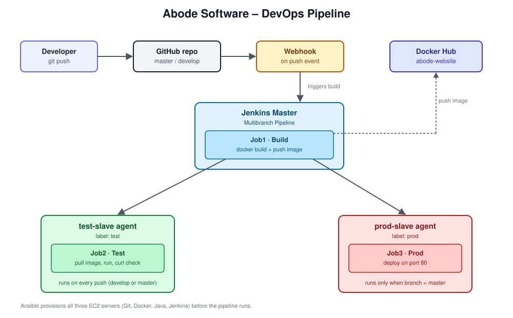
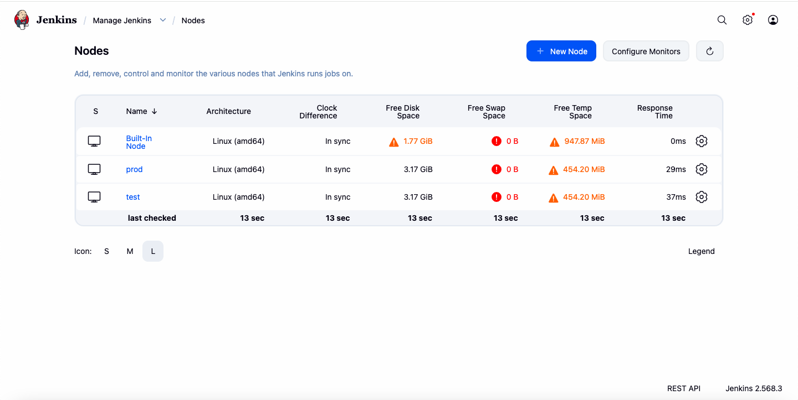
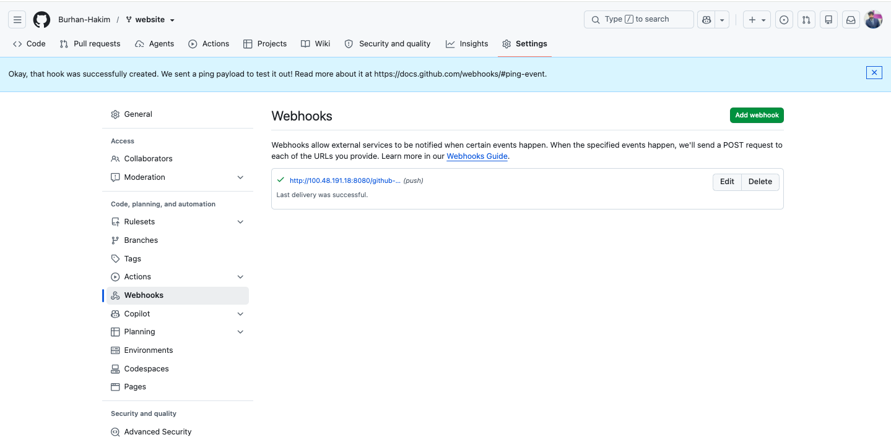
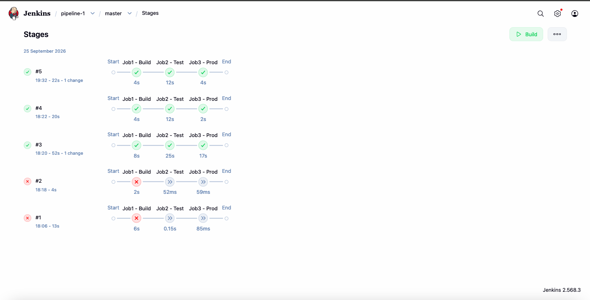
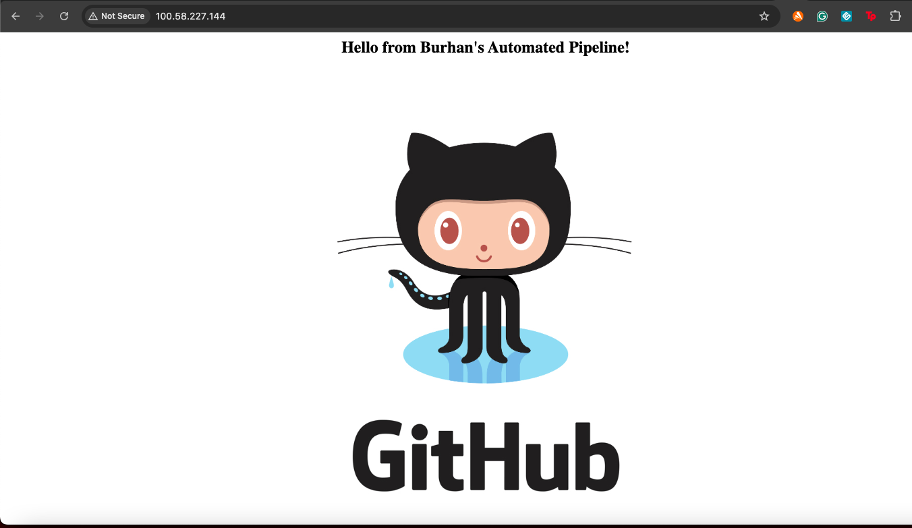

# Abode Software – DevOps Lifecycle Project

A CI/CD pipeline I built for a sample product website — from bare EC2
instances to an automated production deploy, triggered by nothing more
than a git push.

## What it does

Three EC2 servers do the work. Ansible provisions all of them — Git,
Docker and Java everywhere, Jenkins on the master. A GitHub webhook fires
the moment code is pushed to `master` or `develop`, and a Jenkins
Multibranch Pipeline (`pipeline-1`) picks it up automatically:

1. **Build** — Jenkins checks out the code, builds a Docker image, pushes it to Docker Hub
2. **Test** — a dedicated test agent pulls that image, runs it, and hits it with a curl check
3. **Prod** — only when the branch is `master`, a separate prod agent pulls the same image and deploys it on port 80

Pushes to `develop` stop after the test stage. Nothing reaches production without going through that full sequence.

## Architecture

## Stack

AWS EC2 · Ansible · Git / GitHub · Jenkins (1 master + 2 agents) · Docker · Docker Hub

## Repository layout

\`\`\`
├── Dockerfile
├── Jenkinsfile
├── ansible/
│   ├── site.yml
│   └── hosts.example
├── docs/
│   ├── architecture.svg
│   └── screenshots/
└── README.md
\`\`\`

## Screenshots

**Jenkins agents online**

**Webhook delivering successfully**

**Pipeline passing on master**

**Site live in production**

More in `docs/screenshots/` — Ansible provisioning, the Git workflow, and the develop-vs-master build behavior side by side.

## Running it yourself

1. Launch three Ubuntu EC2 instances, add their private IPs to `/etc/ansible/hosts` (see `ansible/hosts.example`)
2. From the master: `ansible-playbook ansible/site.yml`
3. In Jenkins, add credentials for Docker Hub, GitHub, and SSH access to the agents, then register the two agent nodes
4. Create a Multibranch Pipeline pointing at this repo, filtered to `master|develop`
5. Add a GitHub webhook to `http://<jenkins-ip>:8080/github-webhook/`
6. Push to `develop` to see build + test run, or merge into `master` to see a full deploy

## What actually went wrong

My first two pipeline runs failed outright on the build stage — turned out
to be a typo in the Docker Hub credentials. Fixed that and every run since
has gone clean. Also spent a while wondering why Job1 wouldn't start at
all before realizing the Jenkins built-in node had 0 executors configured.

## What I'd change next time

Put the servers behind a load balancer with a real domain and HTTPS
instead of hitting IPs directly, and break the Ansible playbook into
proper roles instead of one long file.

## Author

**Burhan Hakim**
[LinkedIn](https://www.linkedin.com/in/burhan-bashir-hakim-48a8a3225) · [GitHub](https://github.com/Burhan-Hakim)
